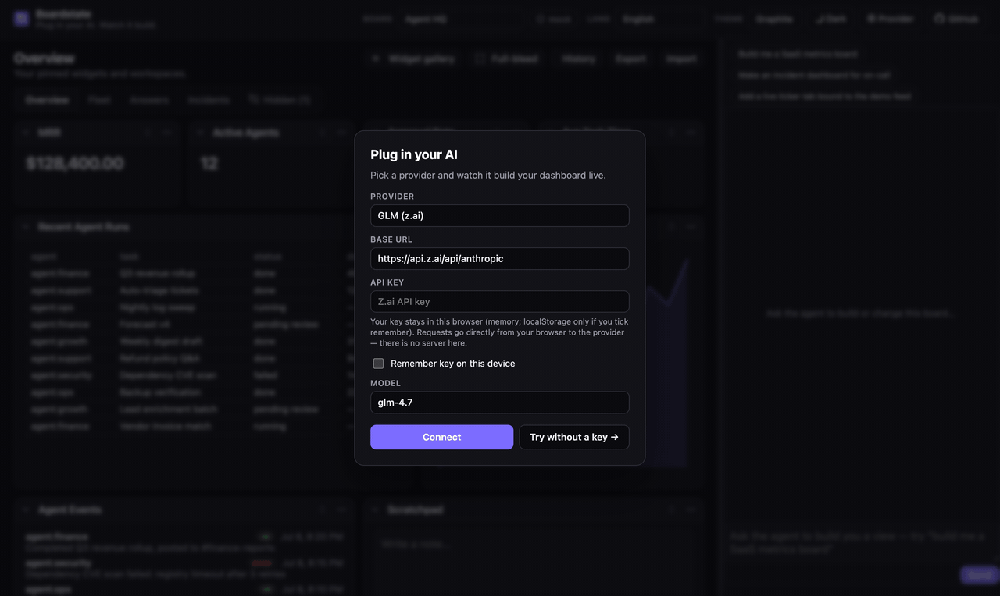
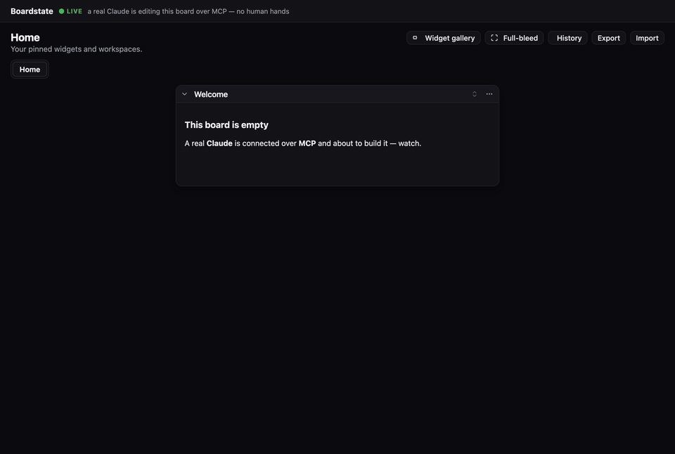
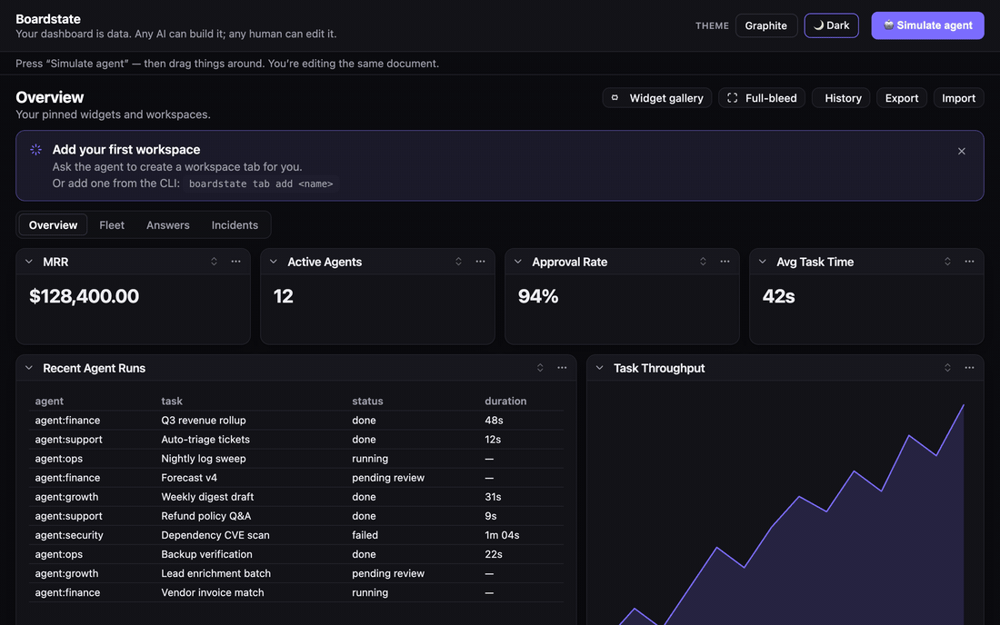
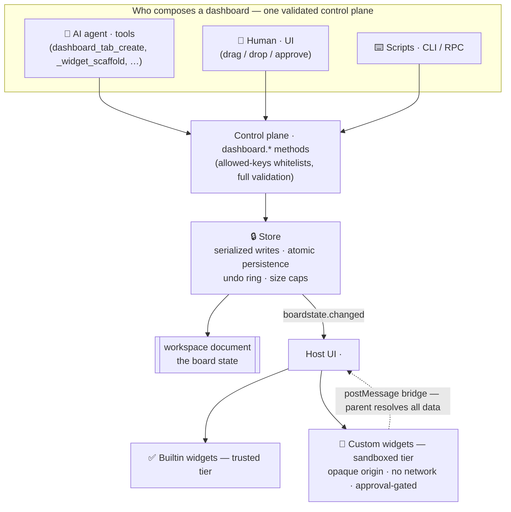
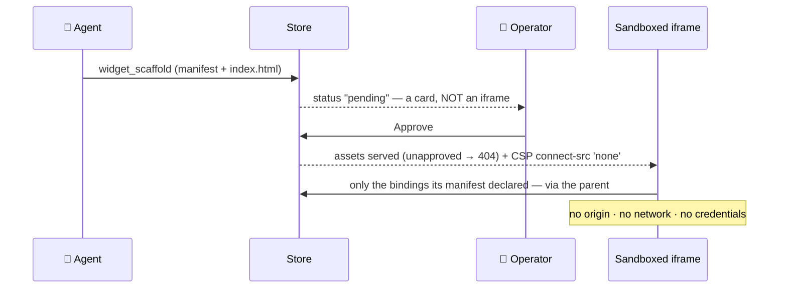
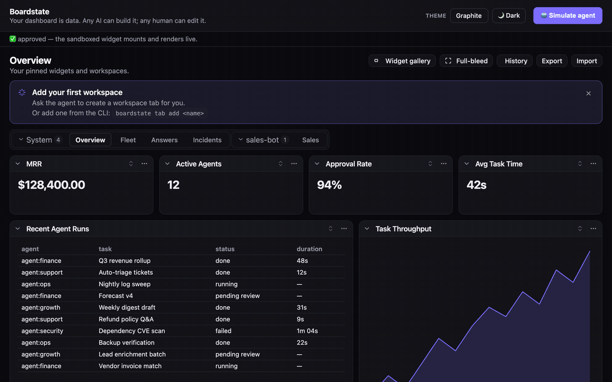
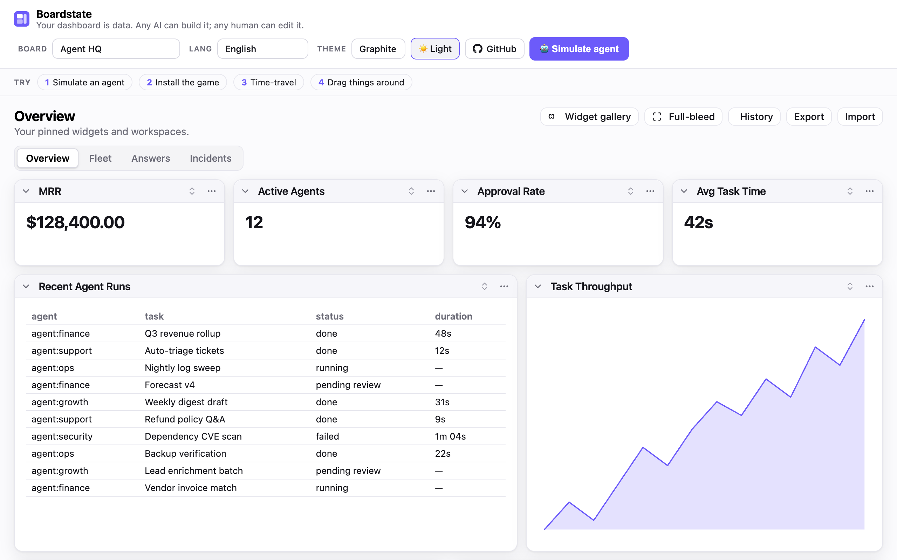
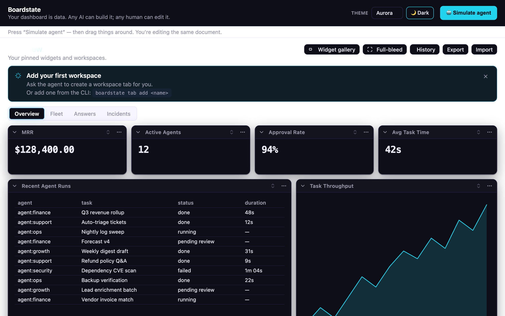
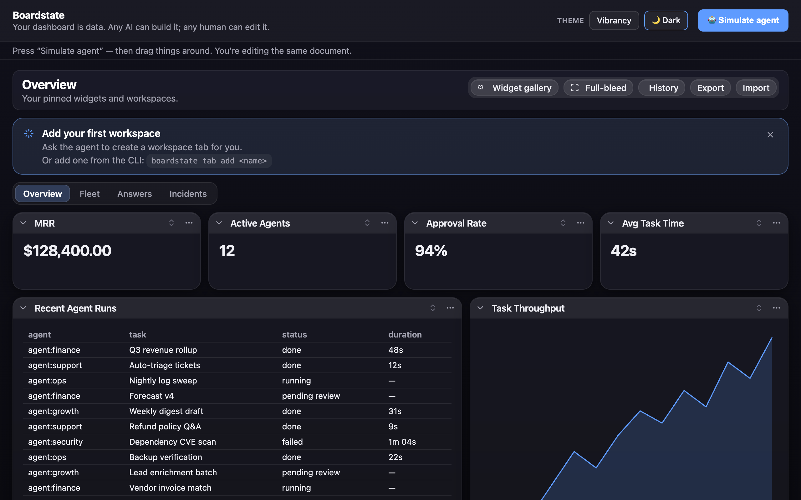

# Boardstate

[](https://github.com/100yenadmin/boardstate/actions/workflows/ci.yml) [](https://www.npmjs.com/package/@boardstate/core) [](LICENSE) [](CONTRIBUTING.md)

> **Your dashboard is data. Any AI can build it; any human can edit it.**

**[▶ Live app — plug in your key](https://100yenadmin.github.io/boardstate/app/)** — bring your own provider (GLM, Anthropic, OpenAI, Ollama, or any OpenAI-compatible endpoint) and watch the AI build your dashboard live, in your browser. Prefer no key? The **[component demo](https://100yenadmin.github.io/boardstate/)** presses “Simulate agent” and composes the board with a scripted agent — then drag things around yourself.



<details>
<summary>More demos: a real Claude over MCP, and the component demo's scripted agent</summary>





</details>

Boardstate is a protocol and runtime for **agent-composable dashboards**. The entire dashboard — tabs, widgets, layout, data bindings, even the registry of agent-authored custom widgets — is one validated JSON document: the _board state_. An AI agent composes it through tools, a human rearranges it with drag & drop, a script edits it over RPC — **all through the same guarded control plane**, with no privileged path. Agent-authored widgets render live inside a sandbox strict enough that foreign code is safe _by construction_, behind an explicit operator approval gate.

- 📄 **The document is the API** — diffable, undoable, exportable, importable, templatable, time-travelable.
- 🤖 **Any AI, zero integration** — `@boardstate/mcp` exposes the full tool set to any MCP client (Claude, or anything else that speaks MCP).
- 🧑‍🎨 **Human parity is a protocol requirement** — drag/drop, collapse, approve, undo: the same methods the agent uses.
- 🔒 **A security ladder, not a warning label** — trusted builtins vs. sandboxed customs (opaque origin, CSP `connect-src 'none'`, capability manifest, approval-gated mount, server-side 404 for anything unapproved).
- 🔌 **Your dashboard can DO things** — Boardstate is also an MCP _client_: point it at OfficeCLI, Pipedream, Composio, or any MCP server and the board reads their tools as live data and runs their tools as operator-confirmed actions (see below).

## Your dashboard can DO things (M5)

Boardstate is an MCP **client**, not just an MCP server. Give it an operator-authored
connector config (`@boardstate/broker`) and it connects outward to an external tool server —
importing that server's read-ish tools as **board data** (`source:"mcp"` bindings) and its
side-effecting tools as **operator-confirmed actions** (action buttons). The whole thing
runs behind the same capability gate as everything else:

1. The agent discovers tools it needs (`boardstate_tool_search`) and **requests** them — it
   can never grant them.
2. A card appears in the approvals widget; a **human operator** grants a subset.
3. Read tools flow onto the board live; anything consequential **parks** as a pending action
   that a networked client physically cannot confirm — only the local operator can.
4. Grants are revocable, and re-pend the instant a tool's surface changes under them.

```sh
pnpm build
node examples/operational-demo/demo.mjs   # keyless — a fake OfficeCLI double; no binary, no keys
```

Open the board and the loopback operator console it prints: approve the grant, watch a table
fill from a live workbook, click "Generate .docx", and confirm the action. OfficeCLI,
Pipedream, and Composio ship as first-party connector presets (`docs/connectors/`). The
broker, its network, and every secret stay node-side — `@boardstate/core` never learns an
external tool exists.

## How it fits together



Why agent-authored code is safe to run:



## Features

### The document is the whole product

Everything below operates on one validated JSON document (≤ 256 KB, schema v1). Because the
board _is_ data, you get for free: **undo** (a 20-entry ring), **export/import** (a board is
a file you can email), **templates** ([`templates/`](templates) — Agent HQ, Showcase,
small-business, OSS-maintainer), **provenance** (every tab and widget records its `createdBy`
actor — human, system, or which agent), and **diffability** (review an agent's board the way
you review a PR). Mutations go through `dashboard.*` methods with per-method allowed-keys
whitelists — unknown keys are rejected at the wire, which catches contract drift before it
ships.

### Widgets: a trusted tier and a sandboxed tier

**17 builtin widgets** cover the common jobs: `stat-card`, `chart`, `table`, `markdown`,
`notes`, `iframe-embed`, `preview`, `activity`, `sessions`, `usage`, `cron`, `instances`,
`agent-status`, `chat` (talk to the agent inside the board), `approvals` (the operator's
grant + pending-action console), `action-form`, and `action-button` (governed actions —
see below). Every builtin has a schema-valid example in the **widget catalog**
(`boardstate_widget_catalog`), honesty-gated in CI so the examples can never rot.

**Custom widgets** are agent- or user-authored HTML that renders live — safely, _by
construction_: opaque-origin iframe, `connect-src 'none'` (no network), a capability
manifest that declares exactly which bindings it may read, an operator approval gate before
first mount, and server-side 404s for unapproved assets. A scaffolded widget lands as a
pending card, not running code.

### Data bindings: six sources, one model

Any widget can bind live data. A binding declares a source; the host resolves and refreshes it:

| Source     | What it does                                                                                         |
| ---------- | ---------------------------------------------------------------------------------------------------- |
| `static`   | Inline JSON (≤ 8 KB) — fixtures, thresholds, copy                                                    |
| `file`     | Reads from the host's state dir — reports, scratch data                                              |
| `rpc`      | Calls a whitelisted host method — anything your host exposes                                         |
| `stream`   | Subscribes to a host event stream — tickers, logs, agent output; updates push live                   |
| `computed` | Derives from other bindings with a pure expression — totals, deltas, ratios                          |
| `mcp`      | Reads a **granted external MCP tool** through the connector broker (readOnly-only, side-effect-free) |

### The agent layer

- **`@boardstate/mcp`** — the full tool set for any MCP client; `--serve` gives you a live
  page of the board being built, and `boardstate_board_view` renders it inside MCP-Apps
  clients like Claude Desktop.
- **`@boardstate/agent`** — the embeddable chat agent: streaming tool loop, provider
  adapters (Anthropic, or any OpenAI-compatible endpoint — GLM, OpenAI, Ollama, vLLM),
  the composition system prompt, and a definition-token budget so big tool catalogs can't
  blow the context.
- **`builtin:chat`** — the conversation lives _on the board_, next to what it's building.
- **The self-building loop** — `boardstate_design_review` + `selfReview:"once"`: the agent
  screenshots the board it just built, critiques it, and fixes what it finds.
- **The conventions** — [living answers](docs/living-answers.md) (answer visual questions
  with widgets, not prose) and [composition patterns](docs/composition-patterns.md) (which
  widget for which job). See **[AGENTS.md](AGENTS.md)** for the full agent guide.

### Actions & the operate loop (the trust spine)

Side effects are first-class and _governed_. The capability broker tracks per-connector,
per-tool **grants** (`requested → granted / denied / revoked`): an agent can discover and
**request** tools (`boardstate_tool_search`) but never grant them; the operator approves a
subset in the approvals widget. Granted `readOnly` tools execute directly; **mutations park**
as pending actions that only the local operator can confirm — a networked client is refused
at the transport (`OPERATOR_ONLY`). Grants **re-pend automatically** if the external server
changes a tool's surface underneath them (anti-rug-pull, both directions), and every invoke
is rate-limited and audit-logged. Reads and actions are different verbs: a `source:"mcp"`
binding resolves through a pure-read verb that structurally cannot trigger a side effect.

### Connectors

`@boardstate/broker` manages outbound MCP connections from an operator-authored config
(stdio or streamable HTTP; secrets as `${ENV}` refs, resolved node-side only — never in the
document, never in the browser). First-party presets: **OfficeCLI** (native, stdio),
**Pipedream** and **Composio** (remote aggregators — thousands of SaaS tools behind one
connector). `installConnectorWorkspace` wires the whole stack into your host in one call.
Setup guides: [`docs/connectors/`](docs/connectors.md).

### Hosts, transports, conformance

Run it your way: fully in-browser (the live demo persists to IndexedDB-like storage via the
core store), a Node host over the hardened **WebSocket transport**, or in-process. The
**`boardstate` CLI** drives the same control plane from your shell. If you build your own
host, **`@boardstate/conformance`** is the transport test suite that tells you it's actually
conformant — the reference implementation also ships as an OpenClaw plugin, the first
conformant host.

### Polish that's included, not promised

A complete default theme (**Graphite**, light + dark) plus two drop-in alternates and a
fully tokenized `--bs-*` custom-property system ([THEME.md](packages/lit/THEME.md));
**20-language localization** with runtime switching; drag & drop with lift-and-carry
ergonomics; typed React wrappers; and a keyboard-reachable, `prefers-color-scheme`-honoring
reference UI.

## Packages

| Package                                  | What it is                                                                          |
| ---------------------------------------- | ----------------------------------------------------------------------------------- |
| [`@boardstate/schema`](packages/schema)  | The document schema, validators, and **[the spec](packages/schema/SPEC.md)**        |
| [`@boardstate/core`](packages/core)      | Headless runtime: store, bindings, grid math, export/import, pub/sub, history       |
| [`@boardstate/server`](packages/server)  | The `dashboard.*` control plane, agent tools, widget serving, CLI                   |
| [`@boardstate/host`](packages/host)      | Framework-free DOM host: sandbox mount, postMessage bridge, client store            |
| [`@boardstate/lit`](packages/lit)        | The reference view — `<boardstate-view>` and 16 builtin widgets, as custom elements |
| [`@boardstate/react`](packages/react)    | Typed React wrappers over the custom elements                                       |
| [`@boardstate/mcp`](packages/mcp)        | MCP server: give any AI the full dashboard tool set                                 |
| [`@boardstate/conformance`](conformance) | The transport conformance suite — run it against _your_ host                        |

## Installation

Pick the entry point that matches what you're building — each is one install:

| You want…                                   | Install                                       | Start here                                                        |
| ------------------------------------------- | --------------------------------------------- | ----------------------------------------------------------------- |
| Any AI building boards (Claude, etc.)       | `npx -y @boardstate/mcp` (no install)         | [Give an AI the board](#usage) · [AGENTS.md](AGENTS.md)           |
| The dashboard UI in your web app            | `npm i @boardstate/lit @boardstate/core`      | [Embed the view](#usage)                                          |
| …with React                                 | `npm i @boardstate/react`                     | [React](#usage)                                                   |
| A networked Node host (multi-client, WS)    | `npm i @boardstate/server`                    | [Run a host](#usage)                                              |
| An embedded chat agent (bring your own key) | `npm i @boardstate/agent`                     | [AGENTS.md §2](AGENTS.md)                                         |
| The board acting through external tools     | `npm i @boardstate/broker`                    | [Connect outward](#usage) · [docs/connectors](docs/connectors.md) |
| A shell workflow / scripting                | `npx --package @boardstate/server boardstate` | [CLI](#usage)                                                     |
| To verify your own host implementation      | `npm i -D @boardstate/conformance`            | [ARCHITECTURE.md](docs/ARCHITECTURE.md)                           |

All packages are MIT, ESM, and published with npm provenance (Sigstore-attested).
Requires Node ≥ 20 for the Node-side packages; the browser packages are framework-free
custom elements (Lit under the hood).

## Quick start

Zero-install: open the **[live demo](https://100yenadmin.github.io/boardstate/)**. Locally:

```sh
git clone https://github.com/100yenadmin/boardstate && cd boardstate
pnpm install && pnpm build
pnpm --filter boardstate-example-standalone dev   # the 60-second demo
```

Either way, press **“simulate agent”**, and watch: a tab appears, charts bind, a custom widget lands as a pending card, you approve it, the sandboxed iframe mounts and renders live. Then drag things around — you and the agent are editing the same document.

## Usage

**Give an AI the board** — the fastest path; any MCP client gets all 20 tools
(full guide + tool catalog: **[AGENTS.md](AGENTS.md)**):

```sh
claude mcp add boardstate -- npx -y @boardstate/mcp   # Claude Code
npx @boardstate/mcp --serve 4400                      # + a live page of the board it builds
```


_That's a real Claude session connected to `@boardstate/mcp` — every widget lands via a `boardstate_*` tool call ([video](docs/media/mcp-demo.mp4))._

**Embed the view** — `<boardstate-view>` is a custom element; hand it a transport:

```js
import "@boardstate/lit/browser";
import "@boardstate/lit/styles.css";
import { createWsTransport } from "@boardstate/core";

const view = document.createElement("boardstate-view");
view.transport = createWsTransport(`ws://${location.host}/ws`);
view.connected = true;
document.getElementById("app").append(view);
```

React: `import { BoardstateView } from "@boardstate/react"` — the same element, typed.

**Run a networked host** — the `dashboard.*` control plane over WebSocket, with the
operator boundary enforced at the transport (see
[`examples/operational-demo/demo.mjs`](examples/operational-demo/demo.mjs) for a complete
~350-line host, and [ARCHITECTURE.md](docs/ARCHITECTURE.md) for the seams):

```js
import {
  createInProcessHost,
  registerBoardstateRpc,
  attachWsTransport,
  nodeRpcDeps,
} from "@boardstate/server/node";
```

**Connect outward** (the operate loop — external tools as data + governed actions):

```sh
node examples/operational-demo/demo.mjs   # keyless demo: approve → table fills → park → confirm
```

Real connectors are a config file + env refs away — OfficeCLI, Pipedream, Composio guides
in [`docs/connectors/`](docs/connectors.md).

**Script it** — the `boardstate` CLI drives the same control plane from your shell
(state dir: `$BOARDSTATE_STATE_DIR`, default `~/.boardstate` — shared with the MCP server):

```sh
npx --package @boardstate/server boardstate tab add sales
npx --package @boardstate/server boardstate dashboard tabs list
```

## Theming

`@boardstate/lit` ships a complete, world-class default theme — **Graphite** (a
Linear / Vercel / Codex-family palette) — that looks great in **light and dark**
out of the box. Import it once; nothing else to configure.

```ts
import "@boardstate/lit";
import "@boardstate/lit/styles.css"; // the Graphite default — light + dark
```

- **Dark mode, free** — `prefers-color-scheme` is honored automatically; pin it
  with `data-theme="dark"` / `"light"` on `<html>` when you want a toggle.
- **Drop-in alternate themes** — layer one after `styles.css` to fully re-skin
  (each ships its own light + dark):

  ```ts
  import "@boardstate/lit/themes/aurora.css"; // futuristic — cyan accent + aurora wash
  import "@boardstate/lit/themes/vibrancy.css"; // macOS-native frosted glass
  ```

- **Total control** — every value is a `--bs-*` custom property; override one
  token or author a whole theme. See **[THEME.md](packages/lit/THEME.md)** for the
  token table and a build-your-own guide.



|                    Graphite (default, light)                    |                        Aurora                        |                         Vibrancy                         |
| :-------------------------------------------------------------: | :--------------------------------------------------: | :------------------------------------------------------: |
|  |  |  |

The **[live demo](https://100yenadmin.github.io/boardstate/)** has the theme
switcher + light/dark toggle in its header — the fastest way to see all three.

## Localization

The view ships partial translations for **20 languages** (Arabic, German, Spanish, Farsi, French, Hindi, Indonesian, Italian, Japanese, Korean, Dutch, Polish, Portuguese-BR, Russian, Thai, Turkish, Ukrainian, Vietnamese, and both Chinese scripts) — faithfully ported from the source project's catalogs; untranslated keys fall back to English. Pass a table to the view's `strings` property:

```ts
import { de } from "@boardstate/lit/locales/de";
view.strings = de; // or any BoardstateStrings partial of your own
```

The live demo's **Lang** menu switches all 20 at runtime.

## Agents

Boardstate is agent-native in both directions — agents **build** the board (MCP server,
embedded chat agent), and the board **acts** through agent-requested, operator-granted
external tools. **[AGENTS.md](AGENTS.md)** is the complete guide: setting up each agent
surface (Claude Code / Claude Desktop config, the embeddable `@boardstate/agent` with
provider adapters, the connector grant loop), the full 20-tool catalog, the composition
conventions that make agent-built boards good, the security invariants agents operate
under — and the house rules for coding agents contributing to this repo.

## Learn more

- **[CHANGELOG.md](CHANGELOG.md)** — the release history by milestone: what each train shipped and why; per-package changelogs hold the granular record.
- **[AGENTS.md](AGENTS.md)** — the agent guide: setup, the tool catalog, conventions, and the invariants.
- **[docs/ROADMAP.md](docs/ROADMAP.md)** — where this is going: substrate → the agent layer (plug in a provider — GLM, Anthropic, any OpenAI-compatible endpoint — and the AI builds the board live), the streaming spec, and phased milestones. Pickup-ready for any contributor.
- **[SPEC.md](packages/schema/SPEC.md)** — the protocol: document format, `dashboard.*` methods, bridge protocol v1, capability & approval model, the security invariants.
- **[docs/ARCHITECTURE.md](docs/ARCHITECTURE.md)** — the implementation: package graph, the three seams (storage / transport / server-host), the request lifecycle, and how to build your own host.
- **[docs/composition-patterns.md](docs/composition-patterns.md)** — the agent's field guide: which builtin for which job, when to scaffold a custom widget, composition rules of thumb.
- **[docs/authoring.md](docs/authoring.md)** — write a widget (builtin renderer or sandboxed custom).
- **[docs/living-answers.md](docs/living-answers.md)** — the agent convention: answer visual questions with live widgets, not prose.
- **[docs/design-review.md](docs/design-review.md)** — the agent workflow for reviewing and refining a layout it built.
- **[templates/](templates)** — workspace templates (Agent HQ, the all-builtins Showcase, small-business, OSS-maintainer), starter custom widgets — including **twenty48**, a sandboxed game you can install from the demo's gallery, and a ready-to-use **widget-gallery registry** (`templates/registry/` — the live demo's gallery points at its hosted copy; point yours at `https://100yenadmin.github.io/boardstate/registry/index.json`).
- **[docs/connectors.md](docs/connectors.md)** — the outward direction: connector setup for OfficeCLI, Pipedream, and Composio, the grant model, and the operational demo.
- **[docs/demo-script.md](docs/demo-script.md)** — the acceptance walkthrough: a scripted Do/Observe tour proving every feature, for maintainers and PR reviewers.
- **[GitHub Discussions](https://github.com/100yenadmin/boardstate/discussions)** — questions, ideas, show-and-tell.

## Status

**Active, and past the extraction phase.** Boardstate originated as the modular-dashboard
system its authors built for [OpenClaw](https://github.com/openclaw/openclaw)
([roadmap & PRs](https://github.com/openclaw/openclaw/issues/101136)) — that plugin is the
first conformant host. Since extraction, five milestone arcs have shipped as attested npm
releases (see **[CHANGELOG.md](CHANGELOG.md)**): the substrate, the agent layer (chat +
embeddable agent + the live app), the hardened WS transport, the trusted-workspace arc
(capability broker, MCP Apps board view, the self-building loop), and **M5 — the
Operational Workspace** (Boardstate as an MCP _client_: external tools as live data +
operator-confirmed actions). The protocol is [SPEC](packages/schema/SPEC.md) v0.2-draft:
stable enough to build a host against, with the conformance suite to prove it.

## License

MIT
