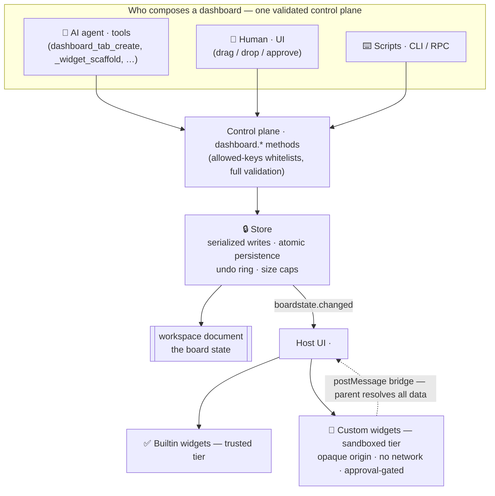
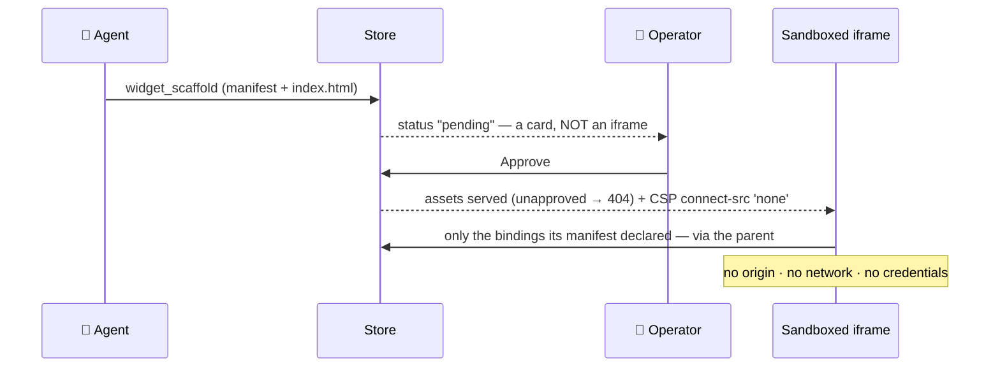

# Boardstate

> **Your dashboard is data. Any AI can build it; any human can edit it.**

Boardstate is a protocol and runtime for **agent-composable dashboards**. The entire dashboard — tabs, widgets, layout, data bindings, even the registry of agent-authored custom widgets — is one validated JSON document: the _board state_. An AI agent composes it through tools, a human rearranges it with drag & drop, a script edits it over RPC — **all through the same guarded control plane**, with no privileged path. Agent-authored widgets render live inside a sandbox strict enough that foreign code is safe _by construction_, behind an explicit operator approval gate.

- 📄 **The document is the API** — diffable, undoable, exportable, importable, templatable, time-travelable.
- 🤖 **Any AI, zero integration** — `@boardstate/mcp` exposes the full tool set to any MCP client (Claude, or anything else that speaks MCP).
- 🧑‍🎨 **Human parity is a protocol requirement** — drag/drop, collapse, approve, undo: the same methods the agent uses.
- 🔒 **A security ladder, not a warning label** — trusted builtins vs. sandboxed customs (opaque origin, CSP `connect-src 'none'`, capability manifest, approval-gated mount, server-side 404 for anything unapproved).

## How it fits together



Why agent-authored code is safe to run:



## Packages

| Package                                  | What it is                                                                          |
| ---------------------------------------- | ----------------------------------------------------------------------------------- |
| [`@boardstate/schema`](packages/schema)  | The document schema, validators, and **[the spec](packages/schema/SPEC.md)**        |
| [`@boardstate/core`](packages/core)      | Headless runtime: store, bindings, grid math, export/import, pub/sub, history       |
| [`@boardstate/server`](packages/server)  | The `dashboard.*` control plane, agent tools, widget serving, CLI                   |
| [`@boardstate/host`](packages/host)      | Framework-free DOM host: sandbox mount, postMessage bridge, client store            |
| [`@boardstate/lit`](packages/lit)        | The reference view — `<boardstate-view>` and 15 builtin widgets, as custom elements |
| [`@boardstate/react`](packages/react)    | Typed React wrappers over the custom elements                                       |
| [`@boardstate/mcp`](packages/mcp)        | MCP server: give any AI the full dashboard tool set                                 |
| [`@boardstate/conformance`](conformance) | The transport conformance suite — run it against _your_ host                        |

## Quick start

```sh
git clone https://github.com/100yenadmin/boardstate && cd boardstate
pnpm install && pnpm build
pnpm --filter boardstate-example-standalone dev   # the 60-second demo
```

Open the example, press **“simulate agent”**, and watch: a tab appears, charts bind, a custom widget lands as a pending card, you approve it, the sandboxed iframe mounts. Then drag things around — you and the agent are editing the same document.

To give an AI the tools directly:

```sh
npx @boardstate/mcp --serve 4400    # MCP stdio server + a live host page
```

## Learn more

- **[SPEC.md](packages/schema/SPEC.md)** — the protocol: document format, `dashboard.*` methods, bridge protocol v1, capability & approval model, the security invariants.
- **[docs/authoring.md](docs/authoring.md)** — write a widget (builtin renderer or sandboxed custom).
- **[docs/living-answers.md](docs/living-answers.md)** — the agent convention: answer visual questions with live widgets, not prose.
- **[docs/design-review.md](docs/design-review.md)** — the agent workflow for reviewing and refining a layout it built.
- **[templates/](templates)** — starter widgets and workspace templates.

## Status

**v0.1 (extraction in progress).** Boardstate is extracted from the modular-dashboard system its authors built for [OpenClaw](https://github.com/openclaw/openclaw) ([roadmap & PRs](https://github.com/openclaw/openclaw/issues/101136)) — that plugin is the first conformant host. The protocol is stable enough to read; the packages land in dependency order (schema → core → server → host → lit).

## License

MIT
