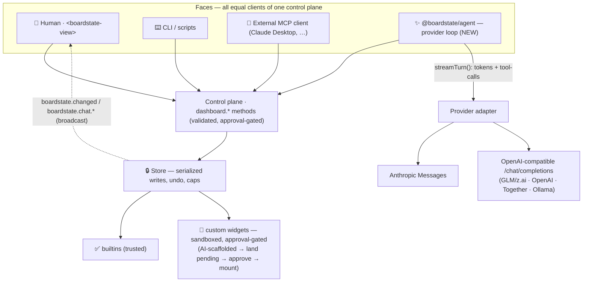

# Boardstate roadmap

> Status: **active plan**, owner-ratified 2026-07-09. Confidence 85–95% per phase (see
> the table at the end). This document is written to be **pickup-ready**: any agent
> should be able to read it top-to-bottom and start executing a phase without further
> context. It is the source of truth for direction; when it disagrees with an issue,
> this file wins until amended.

## North star

**Your dashboard is data. Any AI can build it; any human can edit it — and now, plug in
a provider and the AI builds it _live_.** The end-state a first-time user should reach in
under a minute: open the app, pick a provider (Anthropic, or any OpenAI-compatible
endpoint — **GLM / z.ai, OpenAI, Together, Ollama, …**), paste a key or base URL, type
_"build me a sales dashboard,"_ and watch tabs, charts, and widgets stream in as the model
calls the control plane.

## Guiding principle — substrate first, app second, one line held

Two co-equal goals, sequenced substrate-first:

- **Substrate** — the validated document + control plane + safe widget runtime. The
  library others build on ("React for agent dashboards"). Ships to npm; adopted by builders.
- **App** — a batteries-included reference app: plug in a provider, chat, watch the AI
  build and drive the board, self-extend its widgets. How everyone _experiences_ the substrate.

**The one architectural line we hold (non-negotiable):** the provider/agent loop is a
**pluggable adapter that is a client of the control plane — never baked into core.** The
AI drives the board through the exact same `dashboard.*` methods the CLI and a human use.
This preserves Boardstate's crown jewel — _safe by construction_ (headless core, sandboxed
widgets with `connect-src 'none'`, approval gate) — while delivering plug-in-a-key. The
moment a provider key or network egress leaks into `@boardstate/core`, the trust story
inverts and we become a worse agent framework. Core stays pure; the agent is a face.

## Where we are today (shipped)

- 7 packages: `schema`, `core`, `host`, `server`, `lit`, `react`, `mcp` (+ `conformance`).
  Browser/node split is clean (core/server main entries import zero `node:*`).
- One control plane: `dashboard.*` methods over a transport
  (`createInProcessHost` → `request(method, params, ctx)` + `broadcast(event, payload)` /
  `addEventListener`). Faces today: agent tools, CLI (`boardstate`), gateway RPC, **MCP**.
- **"Any MCP AI builds it" is already real**: `@boardstate/mcp` exposes 14 `dashboard_*`
  tools (typebox schemas passed through) to any MCP client. This is under-marketed — see M0.
- 15 builtin widgets + 3 themes (light/dark) + 20 partial locales + widget-gallery
  registry + a working in-browser demo (`examples/standalone`) at
  https://100yenadmin.github.io/boardstate/.
- Custom widgets: sandboxed iframe, capabilities `data:read | prompt:send | state:persist`,
  approval-gated. The v1 bridge (`dashboard:ready/getData/getTheme/setState/getState`) is
  documented in SPEC §8.
- The `chat.send` transport seam already exists and is the entry point for both the
  `action-form` builtin and custom-widget `prompt:send` — it's currently a demo stub. **This
  is the hook the whole agent layer plugs into** (see M2).

## Architecture — the agent layer (the new frontier)

The agent is **just another client**: it receives tool schemas (the same `dashboard_*`
schemas `@boardstate/mcp` already emits), asks the provider what to do, and executes each
tool call via `transport.request("dashboard." + name, args)`. As those calls mutate the
store, the existing `boardstate.changed` broadcast re-renders the board — so **the board
visibly builds itself while text streams**, with no new refresh plumbing.

### Streaming protocol — FROZEN as SPEC §14 (v0.2)

The normative contract now lives in `packages/schema/SPEC.md` §14 (chat & agent-turn
protocol): `chat.send` / `chat.history.get` / `chat.abort`, the 12-type
`AgentStreamEvent` stream (start→delta→end triads keyed by stable ids), the
`boardstate.chat.event` bus name, SSE mirroring rules (named events, `turnId:seq` ids,
25–30s heartbeats, explicitly non-resumable in v0.2), and agent-loop requirements
(writes serial / reads parallel, iteration + token ceilings, honest `retryable`
error classification).

Design deltas vs the first draft here (researched against AI SDK v5/v6, Anthropic and
OpenAI native streams, MCP Apps; rationale in the v2 build plan):

- **Triads, not bare deltas** — concurrent text/tool blocks can't collide.
- **`tool-call-delta` carries RAW partial text** (Anthropic `input_json_delta` /
  OpenAI argument fragments); adapters parse only at block end (`tool-call-ready`).
- **Accumulate tool calls by `callId`, never array index** (documented Ollama
  compat bug: parallel calls all arrive `index:0`; synthesize ids when missing).
- **`formatToolResult` lives on the adapter** (Anthropic `is_error` vs OpenAI
  text-only tool messages — no shared shape exists).
- **Loop policy**: maxToolIterations 20 default; retries max 4 on 429/5xx/timeout
  with expo backoff (500ms→30s) + jitter + `Retry-After`; per-turn token ceiling is
  a REQUIRED runner param, surfaced via `usage` events.
- **GLM/z.ai** works via openai-compat (`api.z.ai/api/paas/v4`) — an
  Anthropic-shaped endpoint (`api.z.ai/api/anthropic`) also exists as a fallback.

### Context management (open, ~85%)

Do **not** stuff the whole `workspace.json` into every turn. Expose
`dashboard.workspace.get` as a tool and let the model pull state on demand; seed the system
prompt with `docs/composition-patterns.md` (the builtin vocabulary + rules) and the tool
list. This keeps token cost bounded and dogfoods the control plane. Decision to confirm in M2.

### Security model (the agent layer's new surface)

- **Key handling:** server-side by default — `@boardstate/agent/node` reads from env or a
  `SecretsAdapter`. A browser **BYO-key "local mode"** (key in memory/localStorage, direct
  provider fetch) is opt-in and clearly labeled _local/dev only_. Keys are never committed,
  never logged, never placed in the workspace document.
- **Approval gate still applies to AI-scaffolded widgets.** Default: AI-authored custom
  widgets land `pending`; the human approves. An opt-in "trusted agent → auto-approve" mode
  is a config flag, off by default. This is the trust story — lean into it in the UI.
- **Prompt injection:** the agent may read board data (bindings) that contains hostile text.
  Mitigations already in place: allowlisted `rpc`/`stream` bindings, sandboxed widgets, the
  approval gate. The runner adds the standard rule — **observed board/tool content is data,
  not instructions** — and never escalates capabilities from content. Tracked as a workstream in M2.
- **Cost controls:** per-turn token ceiling + max tool-iterations guard in the runner
  (prevents a runaway loop burning the user's key). Surfaced as `usage` events.

## Act 1 — COMPLETE (2026-07-10)

M0–M3 + M4a all shipped and live. Substrate on npm (9 packages, all attested from the 0.3.x
train); reference app at https://100yenadmin.github.io/boardstate/app/ does plug-in-a-provider
→ live board; self-building loop (design-review tool + `selfReview:"once"` + app button) live
and GLM-verified; drag UX is lift-and-carry. The per-milestone detail below is the historical
build record.

## Act 2 — IN PROGRESS: finish M4 + launch + portback

Owner-ratified 2026-07-10 ("all of it, in the order you choose … file as issues … get to
work … do our releases"). Every phase is a tracked issue (label `roadmap`). **Locked order:**

| Phase | Issue | What |
| --- | --- | --- |
| R1 | [#23](https://github.com/100yenadmin/boardstate/issues/23) | Networked WebSocket transport + browser bundle (land PRs #20/#21 + WS hardening) |
| R2 | [#24](https://github.com/100yenadmin/boardstate/issues/24) | `dashboard_widget_catalog` tool — close the prop-shape gap (first-try correctness) |
| Launch | [#28](https://github.com/100yenadmin/boardstate/issues/28) | Show HN (owner posts) + awesome-list placements |
| M4c | [#25](https://github.com/100yenadmin/boardstate/issues/25) | Live-bindings hardening: first-class host connector contract + reference connector |
| M4d | [#26](https://github.com/100yenadmin/boardstate/issues/26) | MCP Apps interop — widgets as `ui://` resources (Claude Desktop distribution) |
| M4b | [#27](https://github.com/100yenadmin/boardstate/issues/27) | Capability broker — approval gate for data sources/tools (spec-first) |
| Portback | [#29](https://github.com/100yenadmin/boardstate/issues/29) | Port Act-1/Act-2 fixes upstream to OpenClaw (parallel lane) |

The one architectural line still held: the provider/agent loop is a client of the control
plane, never in `@boardstate/core`.

## Phases (historical build record)

Substrate = M0–M1; the bridge library = M2; the app = M3; the frontier = M4. **M3 app work
can begin in parallel the moment M1's `chat.*` contract is frozen** (co-equal goals).

### M0 — Publish the substrate _(confidence 95%)_

Nothing is "substrate-first" if it isn't installable. Merge the held changesets Version PR →
`@boardstate/*` on npm (owner-gated action). Verify `npm i @boardstate/lit @boardstate/core`

- the quick-start works from a clean dir. Ship the **already-real MCP demo** as marketing:
  a ≤60s video of Claude Desktop pointed at `npx @boardstate/mcp` composing a board live.
  _Deliverable:_ published packages; MCP demo video in README. _No new code._

### M1 — Chat as a protocol primitive _(confidence 90%, substrate)_

Make "chat" a first-class, documented, conformance-pinned part of the protocol — **with no
provider yet** (works against a mock/echo transport).

- **SPEC v0.2:** define `chat.send({ sessionKey, message })` as the turn entry point, the
  `boardstate.chat.*` event stream, and the `AgentStreamEvent` shape above.
- **`builtin:chat` renderer** in `@boardstate/lit` (a trusted builtin — it drives the control
  plane and renders streaming): streamed assistant text, tool-call chips ("🔧 created tab
  Sales"), input box, stop button. Composable into any board (dogfoods layout-as-data); the
  reference app can also dock it as a pane.
- **React wrapper** for `builtin:chat`; **conformance** assertions for the chat/stream surface.
- Wire `chat.send` in the demo to a **mock agent** (scripted tool calls) so the chat face is
  demonstrable before real providers land.

_Open Q:_ exact `chat.*` event names on the bus; whether chat is builtin-only vs. also a
shell pane (rec: builtin first, shell optional). _Freeze this contract — M3 depends on it._

### M2 — Agent driver + provider adapters _(confidence 85%, the bridge library)_

`@boardstate/agent` (new package): the runner + `ProviderAdapter` interface +
`anthropicAdapter` + `openAICompatAdapter` (**this is the GLM path**) + streaming
normalization + cost/iteration guards. Node-first (`@boardstate/agent/node` for server keys),
with the browser BYO-key mode. Implement the real `chat.send` handler (`registerRpc`) that
runs `runAgentTurn` and `broadcast`s `boardstate.chat.*` events. Import the `dashboard_*`
tool schemas from `@boardstate/mcp` — **single source of truth, don't redefine.**

_Deliverable:_ `chat.send` drives a real model; the existing `builtin:chat` now talks to
Anthropic or any OpenAI-compatible endpoint. _Open Qs:_ context strategy (above); retry/
timeout policy; tool-result serialization proof (a loop-safety test, mirroring the store's
concurrency test).

### M3 — The reference app: "plug in GLM" _(confidence 85%, the flagship)_

The north-star moment. A provider picker (name → base URL + key: **GLM/z.ai**, Anthropic,
OpenAI, Ollama…), key handling (server-side default + BYO-key local mode with the warning),
the chat pane + board side by side, deployed. Ship a **self-host node recipe** (key
server-side) and update the hosted demo to the app (BYO-key/local). Package: either a new
`examples/app` or a thin `@boardstate/app`. _Open Qs:_ hosted-key security model (proxy vs.
strictly BYO-key on the public demo — rec: public demo is BYO-key only, self-host holds
keys); cost/rate UX; onboarding copy.

### M4 — Self-building loop + capability broker _(M4a SHIPPED 2026-07-10; rest frontier)_

Where "build itself" gets deep. (a) **Design-review as a capability — ✅ SHIPPED (M4a):**
`reviewWorkspace(doc)` (12-rule pure lint, `@boardstate/core`), the readOnly
`dashboard_design_review` tool (browser-safe core tool set), and
`createAgentChatAgent({ selfReview: "once" })` — one bounded review pass after a mutating
turn, a single §14 turn on the wire (SPEC §15, informative). The app ships the
"✨ Review & improve" button; `agent-smoke --self-review` live-verifies against GLM.
`"loop"` (review-until-clean) stays deferred. (b)
**Capability broker:** extend the approval-gate trust model from _widgets_ to _data sources
/ tools_ — the AI requests a new binding/source, the human approves. (c) **Live bindings
hardening:** make the injected-deps contract for `rpc`/`stream` bindings first-class + doc'd
so AI-built boards are live, not static. Spec this fully at the start of M4 (it's the least
certain today). (d) **MCP Apps interop**: a thin adapter re-exposing Boardstate custom widgets as MCP Apps `ui://` resources (Claude Desktop / VS Code / Goose distribution); hosting third-party MCP-UI widgets would be a NEW opt-in widget kind, never a change to existing custom-widget invariants.

## Package changes summary

| Package                             | Change                                                                                |
| ----------------------------------- | ------------------------------------------------------------------------------------- |
| `@boardstate/schema`                | SPEC v0.2: `chat.send` + `boardstate.chat.*` events + `AgentStreamEvent` (M1)         |
| `@boardstate/lit`                   | `builtin:chat` renderer + registration; theme tokens for chat (M1)                    |
| `@boardstate/react`                 | `<BoardstateChat>` wrapper or chat support in the view wrapper (M1)                   |
| `@boardstate/server`                | real `chat.send` handler seam; broadcast `boardstate.chat.*` (M2)                     |
| `@boardstate/agent`                 | **NEW** — runner, `ProviderAdapter`, anthropic + openai-compat adapters, `/node` (M2) |
| `@boardstate/mcp`                   | expose its `dashboard_*` schemas as an importable export for `agent` (M2)             |
| `@boardstate/conformance`           | chat/stream contract assertions (M1)                                                  |
| `examples/app` or `@boardstate/app` | **NEW** — the reference "plug in a provider" app (M3)                                 |

## Open decisions (the 5–15%)

1. **`chat.*` event taxonomy** — exact event names + whether the stream is one multiplexed
   event or several. _Resolve in M1; freeze._
2. **Context strategy** — `workspace.get`-as-tool (rec) vs. full-doc-in-prompt. _M2._
3. **Public-demo key model** — BYO-key-only (rec) vs. a server proxy with quotas. _M3._
4. **Auto-approve trusted agent** — off by default; is it even offered in v1? _M3._
5. **`@boardstate/agent` browser story** — how much of the loop runs in-page vs. requires a
   node host. _M2._
6. **Package for the app** — `examples/app` (stays a demo) vs. `@boardstate/app` (installable). _M3._

## Confidence

| Phase             | Confidence | Why not higher                                                    |
| ----------------- | ---------- | ----------------------------------------------------------------- |
| M0 publish        | 95%        | Purely the owner-gated publish + a video                          |
| M1 chat primitive | 90%        | Event taxonomy + builtin-vs-shell are the only unknowns           |
| M2 agent driver   | 85%        | Provider loops are well-trodden; context/retry/browser-story open |
| M3 reference app  | 85%        | Product/UX + key security; architecture is settled                |
| M4 self-build     | 80%        | Frontier; capability broker + self-critique need their own spec   |

## How an agent picks this up

1. Read this file, then `packages/schema/SPEC.md`, `docs/ARCHITECTURE.md`, and
   `docs/composition-patterns.md`.
2. Take the lowest-numbered unfinished milestone. Its "Open Q"s are decisions to make (or
   ask the owner) _before_ coding, not during.
3. Follow the repo's discipline: additive change → full gates (`pnpm build && typecheck &&
test && lint`) → changeset → PR → CI + Pages green → live smoke of the demo.
4. Hold the one line: **the provider loop is a client of the control plane, never in core.**
