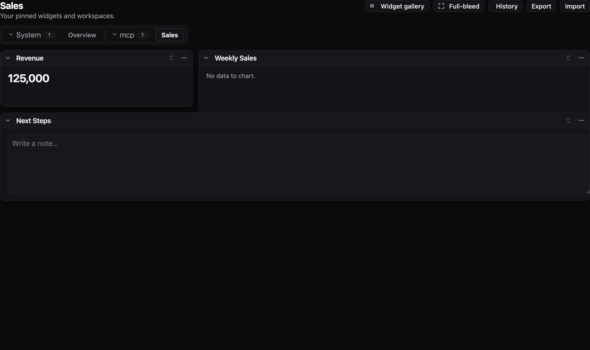

# Use with Hermes Agent

[Hermes Agent](https://github.com/NousResearch/hermes-agent) has a first-class MCP client, so Boardstate works as a drop-in toolset: the agent gets `boardstate_*` tools (tabs, widgets, data, undo, design review) and builds live dashboards you can watch in a browser.

### 1. Register the MCP server

Add to `~/.hermes/config.yaml` (note: the file is `config.yaml` — `cli-config.yaml.example` is just the example's name):

```yaml
mcp_servers:
  boardstate:
    command: npx
    args: ["-y", "@boardstate/mcp", "--state-dir", "~/boards"]
```

Verify: `hermes mcp list` should show `boardstate … ✓ enabled`.

### 2. Build a board

```bash
hermes -t boardstate -z "Build me a sales insights board: a revenue stat card, \
a weekly-sales bar chart with sample data, and a notes widget with next steps."
```

Tip: `-t` (toolsets) accepts MCP server names — `-t search,boardstate` gives the agent web search _plus_ the board tools while keeping the prompt small.

### 3. Watch it live

```bash
npx -y @boardstate/mcp --state-dir ~/boards --serve 4400
# open http://127.0.0.1:4400
```

The served host page renders the same state directory the agent writes — edits stream in as the agent works.




_Screenshot note (kept honest): the stat-card renders the agent-provided value; the chart and notes mounted empty on the first agent run because the agent guessed prop shapes the widgets don't read — see the "field note" in the networked-transport PR; a `widget_catalog` read tool is the planned fix._

### Notes

- Any Hermes provider works. For z.ai/GLM, the native provider is the clean path: `export GLM_API_KEY=...` then `--provider zai -m glm-4.7` (hermes auto-detects the endpoint). If a specific model pool is congested (retries with no output), try another GLM model.
- The MCP server is stdio; Hermes spawns and supervises it per session. State persists in `--state-dir` between runs, so follow-up prompts ("add a churn widget to Sales") evolve the same board.
